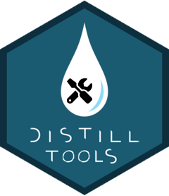

<!-- README.md is generated from README.Rmd. Please edit that file -->

# distilltools 

<!-- badges: start -->
<!-- badges: end -->

`distilltools` is collection of tools to support the creation and
styling of content on websites created using the
[distill](https://rstudio.github.io/distill/) package in R.

It is in the very early stages of development. I am actively seeking
contributions - both ideas and code - to help build the package to be
broadly useful to a wide variety of `distill` users. The idea is for the
package to become a curated, collaborative, community-driven project. In
terms of relationship between packages, I hope in time that
`distilltools` can be for distill something like what
[xaringanExtra](https://pkg.garrickadenbuie.com/xaringanExtra/#/) and
[xaringanthemer](https://pkg.garrickadenbuie.com/xaringanthemer/) are
for [xaringan](https://github.com/yihui/xaringan). Some of what I have
in mind may sit better within the distill package itself, and I will be
reaching out to the distill team about that.

## Installation

    # install.packages("remotes")
    # requires remotes >= 2.2
    remotes::install_github("EllaKaye/distilltools")

    # for remotes < 2.2
    remotes::install_github("EllaKaye/distilltools", ref = "main")

## Functionality

There are currently five exported functions in `distilltools`.

### Blogging functions

-   `create_post_from_template()`: this function works almost
    identically to \[distill::create\_post()\], but extends it with an
    added `path` argument that specifies an `.Rmd` file to use as a
    template for the post. This function can also be run interactively
    using the `Create post from template` RStudio addin. See
    `?create_post_from_template` and `?available_templates` for details
    on using your R Markdown templates with the addin.
-   `available_templates()`: lists a named vector of available R
    Markdown templates for new posts, talks, etc.
-   `create_talk()`: a wrapper around `distill::create_post()` that
    creates a post in the talk directory and includes buttons (made with
    `icon-link()`) for slides (both web and pdf), material, video and
    project. These can easily be edited in the resulting .Rmd file. This
    function was inspired by [Eric Ekholm’s blog
    post](https://www.ericekholm.com/posts/2021-04-02-personalizing-the-distill-template/).

### Styling functions

-   `icon_link()`: creates the html for a link button with icon and
    text. Output of `icon_link` will need styling via the `icon-link`
    class to make it look like a button. For more details on this
    function, see [this blog
    post](https://www.jhelvy.com/posts/2021-03-25-customizing-distill-with-htmltools-and-css/#link-buttons-with-icons-text)
    from John Paul Helveston. For examples of styling the `icon-link`
    class, see [John Paul Helveston’s
    css](https://github.com/jhelvy/jhelvy.com/blob/master/css/jhelvy.css)
    and [Ella Kaye’s
    css](https://github.com/EllaKaye/ellakaye-distill/blob/main/ek_theme.css).
-   `modify_default_highlighting()`: allows the user to swap the five
    colours used in {distill}’s default syntax highlighting scheme with
    five colours of their choice, and saves the resulting `.theme` file
    into the working directory.

## Future functionality

Plans for future functionality include:

-   incorporating more of [John Paul Helveston’s
    functions](https://github.com/jhelvy/jhelvy.com/blob/master/R/functions.R)
-   allowing easy creation and styling of project cards, as on [Ijeamaka
    Anyene’s site](https://ijeamaka-anyene.netlify.app/projects.html)

## Contributing to `distilltools`

We’re actively seeking contributions!

-   Do you have a `distill` website? If so, what tools would you help
    you in the creation, upkeep and styling of your site? Let us know by
    with an [issue](https://github.com/EllaKaye/distilltools/issues).
-   Do you have functions that you’ve written for your `distill`
    workflow? If they help you, they’ll almost certainly be helpful to
    others to. Consider submitting (generalized) versions of them for
    inclusion in `distilltools`!

There are lots of other ways to support and contribute to
`distilltools`. Please see the [contributing
guide](.github/CONTRIBUTING.md) for more details.

## Code of Conduct

Please note that the `distilltools` project is released with a
[Contributor Code of Conduct](.github/CODE_OF_CONDUCT.md). By
contributing to this project, you agree to abide by its terms.
